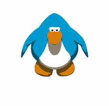

<h1>Hi 👋, I'm Pat</h1>

<h3>I’m a fullstack dev, artist, designer and a student from Thailand</h3>

 

<!-- 

  

 -->

<!-- <h5 align="center">Eat • Sleep • Play Games • Sleep • Sleep • Sleep </h4> -->

<h2 align="center">Technologies</h2>

  

<h2 align="center">Languages</h2>

  

<!-- 

 for dropdown-->
<!-- 

 for dropdown title -->

 

